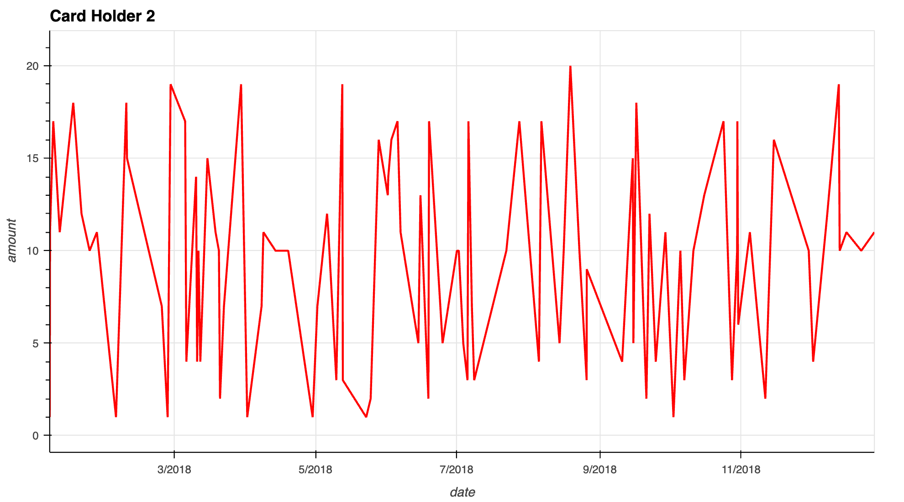
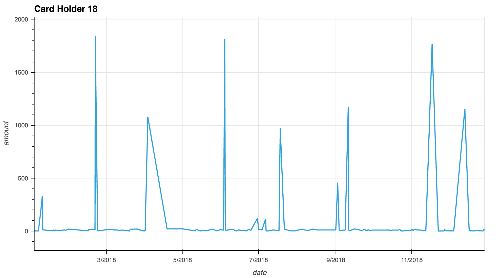
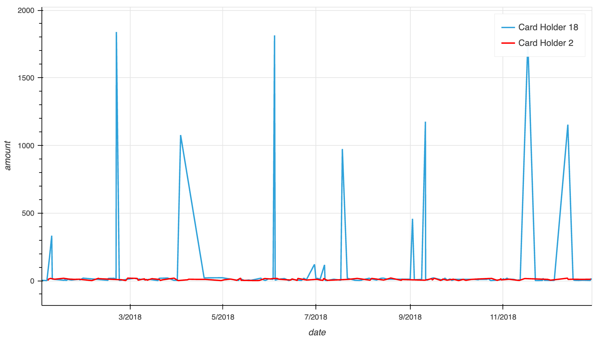
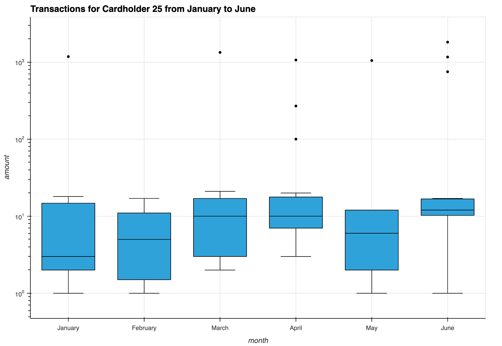

# SuspiciousTransactions
1. Data Modeling
2. Data Analysis. Part 1: SQL
3. Data Analysis. Part 2: Visual Analysis
4. Challenge

## Data Modeling

Create an entity relationship diagram (ERD) by inspecting the provided CSV files.

## Data Analysis. Part 1: SQL

[Queries](sql/queries.sql)

## Data Analysis. Part 2: Visual Analysis

The two most important customers of the firm may have been hacked. Verify if there are any fraudulent transactions in their history. For privacy reasons, you only know that their cardholder IDs are 2 and 18.

Using hvPlot, create a line plot representing the time series of transactions over the course of the year for each cardholder separately. 

  

 

Next, to better compare their patterns, create a single line plot that contains both card holders' trend data.  

Using Plotly Express, create a box plot, representing the expenditure data from January 2018 to June 2018 for cardholder ID 25.

## Challenge

[Notebook](challenge.ipynb)

