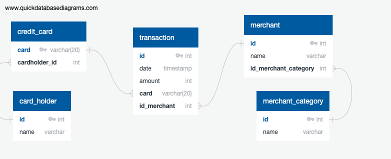

# SuspiciousTransactions

## Table of Contents
1. [Data Modeling](#data-modeling)
2. [Data Analysis Part 1: SQL](#part-1)
3. [Data Analysis Part 2: Visual Analysis](#part-2)
4. [Challenge](#challenge)
5. [Results](#results)

## Data Modeling

Create an entity relationship diagram (ERD) by inspecting the provided CSV files.

  
